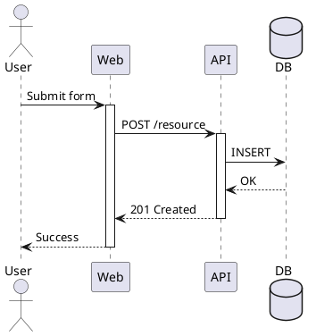
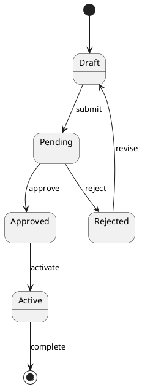
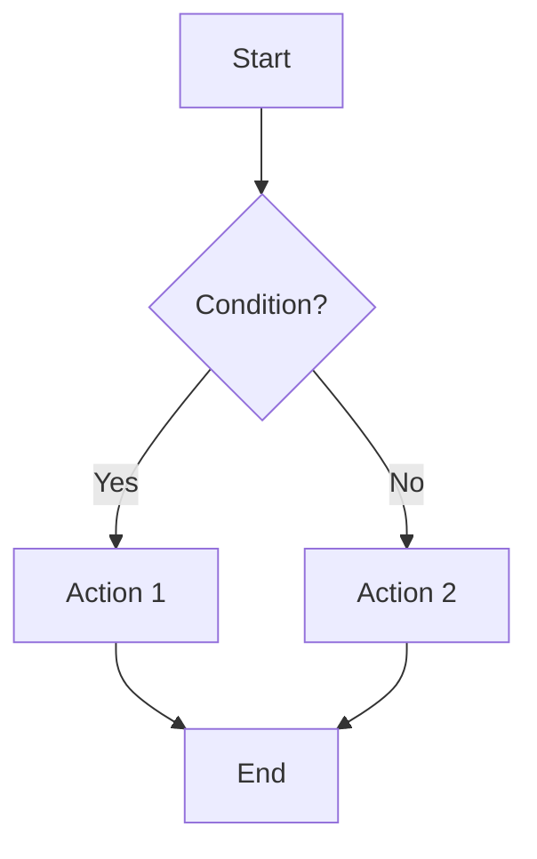

# Diagram Generation with Kroki

## MCP Setup

Add to `.claude/mcp.json`:

```json
{
  "mcpServers": {
    "uml": {
      "command": "uvx",
      "args": ["uml-mcp"],
      "env": { "KROKI_SERVER": "https://kroki.io" }
    }
  }
}
```

Self-hosted: `podman run -d -p 8000:8000 yuzutech/kroki`

## Quick Reference

| Diagram Type | Syntax | Best For |
|--------------|--------|----------|
| C4 Context/Container | PlantUML + C4 stdlib | Architecture overview |
| Sequence | PlantUML | API flows, interactions |
| Class | PlantUML | Domain models |
| State | PlantUML or Mermaid | State machines |
| Flowchart | Mermaid | Simple flows, decisions |
| ERD | DBML or PlantUML | Database schemas |
| Network/Infra | D2 | Modern architecture |

## C4 Diagrams

### Context Diagram

```plantuml
@startuml
!include https://raw.githubusercontent.com/plantuml-stdlib/C4-PlantUML/master/C4_Context.puml

Person(user, "User", "Description")
System(system, "System", "What it does")
System_Ext(external, "External", "Third party")

Rel(user, system, "Uses")
Rel(system, external, "Calls")
SHOW_LEGEND()
@enduml
```

### Container Diagram

```plantuml
@startuml
!include https://raw.githubusercontent.com/plantuml-stdlib/C4-PlantUML/master/C4_Container.puml

Person(user, "User")
System_Boundary(system, "System") {
    Container(web, "Web App", "React", "UI")
    Container(api, "API", "Go", "Business logic")
    ContainerDb(db, "Database", "PostgreSQL", "Data store")
}

Rel(user, web, "Uses", "HTTPS")
Rel(web, api, "Calls", "JSON/HTTPS")
Rel(api, db, "Reads/Writes", "SQL")
SHOW_LEGEND()
@enduml
```

## Sequence Diagrams



## State Machines



## Flowcharts (Mermaid)



## Entity Relationships (DBML)

```dbml
Table users {
  id uuid [pk]
  email varchar [unique, not null]
  created_at timestamp [default: `now()`]
}

Table orders {
  id uuid [pk]
  user_id uuid [ref: > users.id]
  status order_status
}

Enum order_status {
  pending
  completed
  cancelled
}
```

## D2 Architecture

```d2
direction: right

user: User { shape: person }
system: {
  web: Web App
  api: API
  db: Database { shape: cylinder }

  web -> api: REST
  api -> db: SQL
}
external: External API { shape: cloud }

user -> system.web
system.api -> external
```

## File Organization

```
diagrams/
├── architecture/
│   ├── c4-context.puml
│   └── c4-container.puml
├── behavior/
│   ├── sequence-{flow}.puml
│   └── state-{entity}.puml
├── data/
│   └── erd-{domain}.dbml
└── rendered/
    ├── png/
    └── svg/
```

## Workflow

1. Choose diagram type based on what you're documenting
2. Write diagram source using appropriate syntax
3. Render via MCP: `uml:render_plantuml` or `uml:render_mermaid`
4. Save source to `diagrams/` directory
5. Generated images go to `diagrams/rendered/`

## Naming Convention

`{type}-{subject}.{ext}`

Examples:
- `c4-context.puml`
- `sequence-user-login.puml`
- `state-order.puml`
- `erd-users.dbml`
