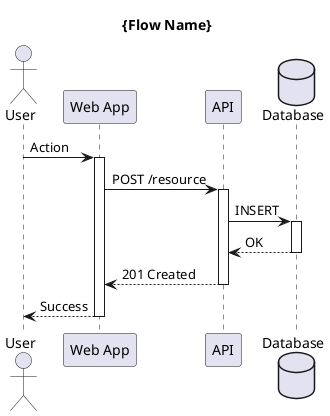
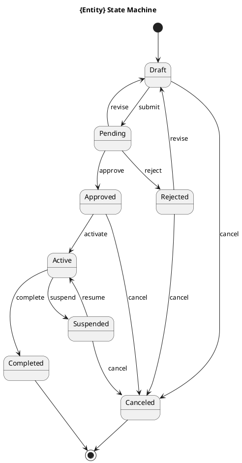
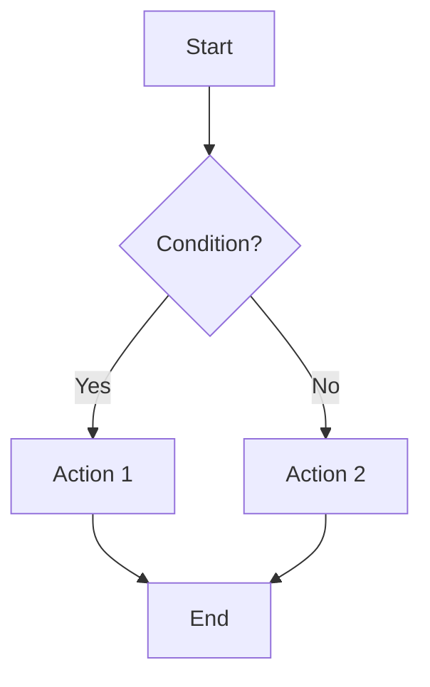

# UML Diagram Integration (Kroki + UML-MCP)

## Overview

This integration uses **Kroki** as the unified diagram rendering engine, accessed via the **UML-MCP** server for Claude Code integration. Kroki supports 20+ diagram formats through a single API.

## Supported Diagram Types

| Type | Syntax | Best For |
|------|--------|----------|
| **PlantUML** | `@startuml/@enduml` | UML, C4, sequence, class diagrams |
| **Mermaid** | `mermaid` | Flowcharts, state, ER diagrams |
| **D2** | `d2` | Modern architecture diagrams |
| **GraphViz** | `dot` | Dependency graphs, networks |
| **C4** | PlantUML + C4 stdlib | Architecture documentation |
| **DBML** | `dbml` | Database schemas |
| **Structurizr** | `structurizr` | C4 model DSL |

## MCP Server Setup

### Option 1: Use Existing UML-MCP

Add to your Claude Code MCP configuration (`~/.claude/mcp.json` or project `.claude/mcp.json`):

```json
{
  "mcpServers": {
    "uml": {
      "command": "uvx",
      "args": ["uml-mcp"],
      "env": {
        "KROKI_SERVER": "https://kroki.io"
      }
    }
  }
}
```

### Option 2: Self-Hosted Kroki (Recommended for Production)

```json
{
  "mcpServers": {
    "uml": {
      "command": "uvx",
      "args": ["uml-mcp"],
      "env": {
        "KROKI_SERVER": "http://localhost:8000"
      }
    }
  }
}
```

Run Kroki locally with Podman:

```bash
podman run -d --name kroki -p 8000:8000 yuzutech/kroki
```

## Available MCP Tools

The UML-MCP server provides these tools:

| Tool | Description |
|------|-------------|
| `uml:generate_diagram` | Generate diagram from text description |
| `uml:render_plantuml` | Render PlantUML syntax to image |
| `uml:render_mermaid` | Render Mermaid syntax to image |
| `uml:render_d2` | Render D2 syntax to image |
| `uml:get_playground_link` | Get link to online editor |
| `uml:list_diagram_types` | List all supported diagram types |

## Diagram Standards

### File Organization

```
./planning/{project}/diagrams/
├── architecture/
│   ├── c4-context.puml          # System context
│   ├── c4-container.puml        # Container view
│   └── c4-component-{name}.puml # Component views
├── behavior/
│   ├── use-case-{feature}.puml  # Use case diagrams
│   ├── sequence-{flow}.puml     # Sequence diagrams
│   ├── activity-{process}.puml  # Activity diagrams
│   └── state-{entity}.puml      # State machines
├── data/
│   ├── erd-{domain}.dbml        # Entity relationships
│   └── class-{module}.puml      # Class diagrams
└── infrastructure/
    ├── deployment.puml          # Deployment topology
    └── network.d2               # Network architecture
```

### Naming Conventions

- Use lowercase with hyphens: `user-registration-flow.puml`
- Prefix with diagram type: `sequence-`, `class-`, `state-`, `c4-`
- Include version for major changes: `c4-context-v2.puml`

## Diagram Templates

### C4 Context Diagram

```plantuml
@startuml c4-context
!include https://raw.githubusercontent.com/plantuml-stdlib/C4-PlantUML/master/C4_Context.puml

title System Context Diagram - {System Name}

Person(user, "User", "Description of user")
System(system, "System Name", "System description")
System_Ext(external, "External System", "External system description")

Rel(user, system, "Uses")
Rel(system, external, "Calls API")

SHOW_LEGEND()
@enduml
```

### C4 Container Diagram

```plantuml
@startuml c4-container
!include https://raw.githubusercontent.com/plantuml-stdlib/C4-PlantUML/master/C4_Container.puml

title Container Diagram - {System Name}

Person(user, "User", "Description")

System_Boundary(system, "System Name") {
    Container(web, "Web Application", "TypeScript, React", "User interface")
    Container(api, "API Service", "Go", "REST API")
    ContainerDb(db, "Database", "PostgreSQL", "Stores data")
    ContainerQueue(queue, "Message Queue", "NATS", "Async messaging")
}

System_Ext(external, "External API", "Third-party service")

Rel(user, web, "Uses", "HTTPS")
Rel(web, api, "Calls", "HTTPS/JSON")
Rel(api, db, "Reads/Writes", "SQL")
Rel(api, queue, "Publishes", "NATS")
Rel(api, external, "Calls", "HTTPS")

SHOW_LEGEND()
@enduml
```

### Sequence Diagram



### State Diagram



### Entity Relationship (DBML)

```dbml
// {Domain} Database Schema

Table users {
  id uuid [pk]
  email varchar(255) [unique, not null]
  name varchar(255) [not null]
  status user_status [not null, default: 'active']
  created_at timestamp [not null, default: `now()`]
  updated_at timestamp [not null]
}

Table resources {
  id uuid [pk]
  user_id uuid [ref: > users.id, not null]
  name varchar(255) [not null]
  description text
  status resource_status [not null, default: 'draft']
  created_at timestamp [not null, default: `now()`]
  updated_at timestamp [not null]

  indexes {
    user_id
    status
    (user_id, status)
  }
}

Enum user_status {
  active
  inactive
  suspended
}

Enum resource_status {
  draft
  pending
  approved
  rejected
}
```

### Mermaid Flowchart



### D2 Architecture

```d2
direction: right

user: User {
  shape: person
}

system: System {
  web: Web App {
    shape: rectangle
  }
  api: API Service {
    shape: rectangle
  }
  db: Database {
    shape: cylinder
  }

  web -> api: REST
  api -> db: SQL
}

external: External API {
  shape: cloud
}

user -> system.web: HTTPS
system.api -> external: HTTPS
```

## Workflow Integration

### Phase 4: Diagrams & Artifacts

When executing Phase 4, use these MCP tools:

1. **Use Case Diagrams**: `uml:render_plantuml` with use case template
2. **State Diagrams**: `uml:render_plantuml` with state template
3. **Flow Diagrams**: `uml:render_mermaid` for simple flows

### Phase 5: Architecture & Design

1. **C4 Context**: `uml:render_plantuml` with C4 context template
2. **C4 Container**: `uml:render_plantuml` with C4 container template
3. **Class Diagrams**: `uml:render_plantuml` for domain models
4. **ERD**: `uml:render_plantuml` with DBML or ERD syntax

### Phase 6: Interface Contracts

1. **Sequence Diagrams**: `uml:render_plantuml` for API flows
2. **Component Diagrams**: `uml:render_plantuml` for service boundaries

## Validation Checklist

For each diagram:

- [ ] Diagram renders without errors
- [ ] All elements are labeled clearly
- [ ] Relationships have descriptions
- [ ] Legend included (for C4)
- [ ] Stored in correct directory
- [ ] Named according to convention
- [ ] Referenced in planning documents

## Rendering Outputs

Diagrams are rendered to:

```
./planning/{project}/diagrams/rendered/
├── png/                    # For documentation
├── svg/                    # For web/scalable
└── pdf/                    # For formal documents
```

## Example: Generate Diagram via MCP

```
User: Create a sequence diagram for user login flow

Claude: I'll use the UML MCP to generate this diagram.

[Calls uml:render_plantuml with login sequence template]

Diagram saved to: ./planning/my-project/diagrams/behavior/sequence-user-login.puml
Rendered PNG: ./planning/my-project/diagrams/rendered/png/sequence-user-login.png
Playground: https://kroki.io/plantuml/svg/...
```
