# Code Architecture - UML Diagrams

## 1. System Component Diagram

```mermaid
graph TB
    subgraph "User Interface"
        CLI[kubefwd-ctl<br/>CLI Binary]
    end

    subgraph "Daemon Process"
        subgraph "Core"
            Main[main.rs<br/>Entry Point]
            Daemon[Daemon<br/>Orchestrator]
            Config[ConfigLoader<br/>YAML Parser]
            State[StateManager<br/>Persistence]
        end

        subgraph "Kubefwd Integration"
            Supervisor[KubefwdSupervisor<br/>Process Manager]
            Client[KubefwdClient<br/>REST API]
            Events[EventListener<br/>SSE Stream]
        end

        subgraph "IPC"
            Server[IpcServer<br/>Unix Socket]
            Protocol[IpcProtocol<br/>JSON Messages]
        end
    end

    subgraph "External"
        Kubefwd[kubefwd<br/>v1.25.0+]
        K8s[Kubernetes<br/>API Server]
        Hosts[/etc/hosts]
    end

    CLI -->|Unix Socket| Server
    Main --> Daemon
    Daemon --> Config
    Daemon --> State
    Daemon --> Supervisor
    Daemon --> Server
    Supervisor --> Kubefwd
    Client -->|HTTP REST| Kubefwd
    Events -->|SSE| Kubefwd
    Kubefwd -->|Port Forward| K8s
    Kubefwd -->|Modify| Hosts
```

## 2. Module Structure

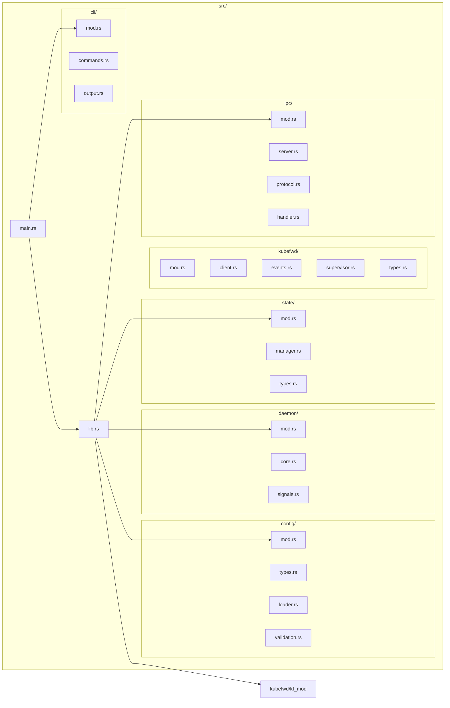
```mermaid
graph LR
    subgraph "src/"
        main[main.rs]
        lib[lib.rs]

        subgraph "config/"
            config_mod[mod.rs]
            config_types[types.rs]
            config_loader[loader.rs]
            config_validate[validation.rs]
        end

        subgraph "daemon/"
            daemon_mod[mod.rs]
            daemon_core[core.rs]
            daemon_signals[signals.rs]
        end

        subgraph "kubefwd/"
            kf_mod[mod.rs]
            kf_client[client.rs]
            kf_events[events.rs]
            kf_supervisor[supervisor.rs]
            kf_types[types.rs]
        end

        subgraph "state/"
            state_mod[mod.rs]
            state_manager[manager.rs]
            state_types[types.rs]
        end

        subgraph "ipc/"
            ipc_mod[mod.rs]
            ipc_server[server.rs]
            ipc_protocol[protocol.rs]
            ipc_handler[handler.rs]
        end

        subgraph "cli/"
            cli_mod[mod.rs]
            cli_commands[commands.rs]
            cli_output[output.rs]
        end
    end

    main --> lib
    lib --> config_mod
    lib --> daemon_mod
    lib --> kubefwd/kf_mod
    lib --> state_mod
    lib --> ipc_mod
    main --> cli_mod
```

## 3. Class Diagram - Core Types

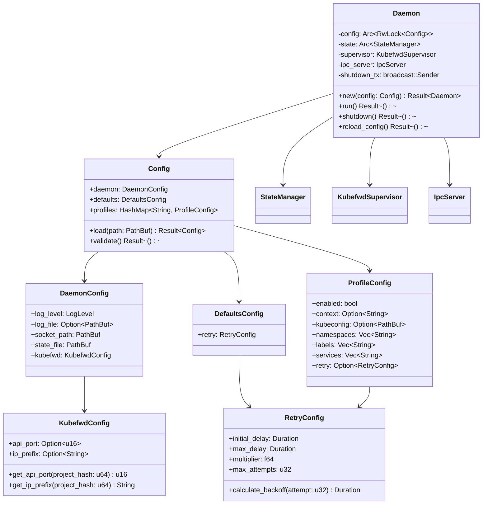
```mermaid
classDiagram
    class Daemon {
        -config: Arc~RwLock~Config~~
        -state: Arc~StateManager~
        -supervisor: KubefwdSupervisor
        -ipc_server: IpcServer
        -shutdown_tx: broadcast::Sender
        +new(config: Config) Result~Daemon~
        +run() Result~()~
        +shutdown() Result~()~
        +reload_config() Result~()~
    }

    class Config {
        +daemon: DaemonConfig
        +defaults: DefaultsConfig
        +profiles: HashMap~String, ProfileConfig~
        +load(path: PathBuf) Result~Config~
        +validate() Result~()~
    }

    class DaemonConfig {
        +log_level: LogLevel
        +log_file: Option~PathBuf~
        +socket_path: PathBuf
        +state_file: PathBuf
        +kubefwd: KubefwdConfig
    }

    class KubefwdConfig {
        +api_port: Option~u16~
        +ip_prefix: Option~String~
        +get_api_port(project_hash: u64) u16
        +get_ip_prefix(project_hash: u64) String
    }

    class ProfileConfig {
        +enabled: bool
        +context: Option~String~
        +kubeconfig: Option~PathBuf~
        +namespaces: Vec~String~
        +labels: Vec~String~
        +services: Vec~String~
        +retry: Option~RetryConfig~
    }

    class RetryConfig {
        +initial_delay: Duration
        +max_delay: Duration
        +multiplier: f64
        +max_attempts: u32
        +calculate_backoff(attempt: u32) Duration
    }

    class DefaultsConfig {
        +retry: RetryConfig
    }

    Daemon --> Config
    Daemon --> StateManager
    Daemon --> KubefwdSupervisor
    Daemon --> IpcServer
    Config --> DaemonConfig
    Config --> DefaultsConfig
    Config --> ProfileConfig
    DaemonConfig --> KubefwdConfig
    DefaultsConfig --> RetryConfig
    ProfileConfig --> RetryConfig
```

## 4. Class Diagram - Kubefwd Integration

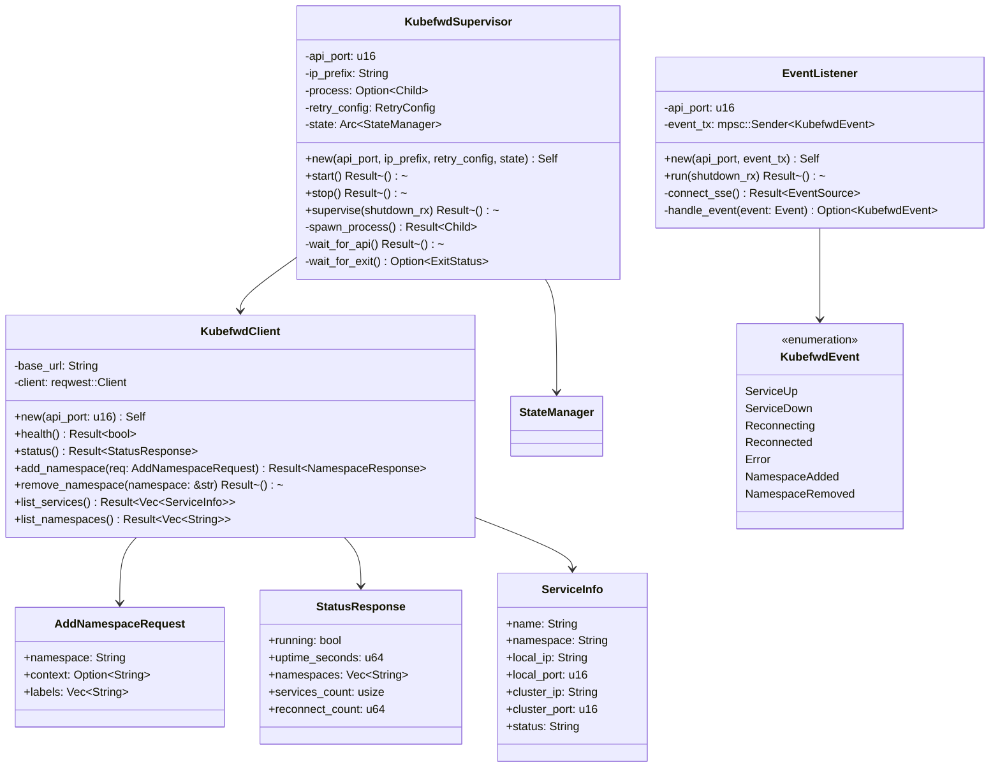
```mermaid
classDiagram
    class KubefwdSupervisor {
        -api_port: u16
        -ip_prefix: String
        -process: Option~Child~
        -retry_config: RetryConfig
        -state: Arc~StateManager~
        +new(api_port, ip_prefix, retry_config, state) Self
        +start() Result~()~
        +stop() Result~()~
        +supervise(shutdown_rx) Result~()~
        -spawn_process() Result~Child~
        -wait_for_api() Result~()~
        -wait_for_exit() Option~ExitStatus~
    }

    class KubefwdClient {
        -base_url: String
        -client: reqwest::Client
        +new(api_port: u16) Self
        +health() Result~bool~
        +status() Result~StatusResponse~
        +add_namespace(req: AddNamespaceRequest) Result~NamespaceResponse~
        +remove_namespace(namespace: &str) Result~()~
        +list_services() Result~Vec~ServiceInfo~~
        +list_namespaces() Result~Vec~String~~
    }

    class EventListener {
        -api_port: u16
        -event_tx: mpsc::Sender~KubefwdEvent~
        +new(api_port, event_tx) Self
        +run(shutdown_rx) Result~()~
        -connect_sse() Result~EventSource~
        -handle_event(event: Event) Option~KubefwdEvent~
    }

    class KubefwdEvent {
        <<enumeration>>
        ServiceUp
        ServiceDown
        Reconnecting
        Reconnected
        Error
        NamespaceAdded
        NamespaceRemoved
    }

    class AddNamespaceRequest {
        +namespace: String
        +context: Option~String~
        +labels: Vec~String~
    }

    class StatusResponse {
        +running: bool
        +uptime_seconds: u64
        +namespaces: Vec~String~
        +services_count: usize
        +reconnect_count: u64
    }

    class ServiceInfo {
        +name: String
        +namespace: String
        +local_ip: String
        +local_port: u16
        +cluster_ip: String
        +cluster_port: u16
        +status: String
    }

    KubefwdSupervisor --> KubefwdClient
    KubefwdSupervisor --> StateManager
    EventListener --> KubefwdEvent
    KubefwdClient --> AddNamespaceRequest
    KubefwdClient --> StatusResponse
    KubefwdClient --> ServiceInfo
```

## 5. Class Diagram - State Management

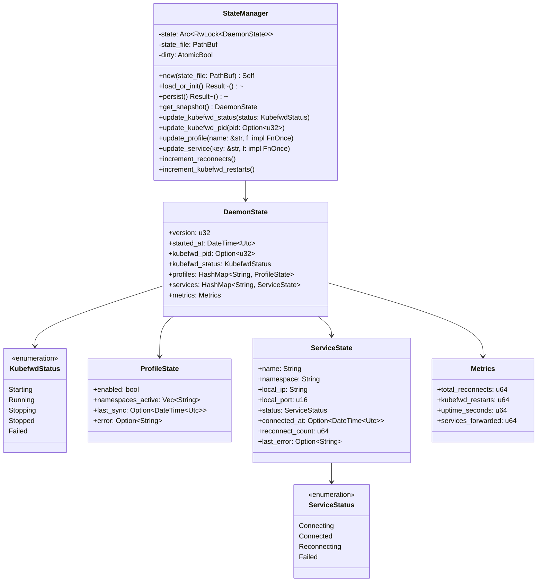
```mermaid
classDiagram
    class StateManager {
        -state: Arc~RwLock~DaemonState~~
        -state_file: PathBuf
        -dirty: AtomicBool
        +new(state_file: PathBuf) Self
        +load_or_init() Result~()~
        +persist() Result~()~
        +get_snapshot() DaemonState
        +update_kubefwd_status(status: KubefwdStatus)
        +update_kubefwd_pid(pid: Option~u32~)
        +update_profile(name: &str, f: impl FnOnce)
        +update_service(key: &str, f: impl FnOnce)
        +increment_reconnects()
        +increment_kubefwd_restarts()
    }

    class DaemonState {
        +version: u32
        +started_at: DateTime~Utc~
        +kubefwd_pid: Option~u32~
        +kubefwd_status: KubefwdStatus
        +profiles: HashMap~String, ProfileState~
        +services: HashMap~String, ServiceState~
        +metrics: Metrics
    }

    class KubefwdStatus {
        <<enumeration>>
        Starting
        Running
        Stopping
        Stopped
        Failed
    }

    class ProfileState {
        +enabled: bool
        +namespaces_active: Vec~String~
        +last_sync: Option~DateTime~Utc~~
        +error: Option~String~
    }

    class ServiceState {
        +name: String
        +namespace: String
        +local_ip: String
        +local_port: u16
        +status: ServiceStatus
        +connected_at: Option~DateTime~Utc~~
        +reconnect_count: u64
        +last_error: Option~String~
    }

    class ServiceStatus {
        <<enumeration>>
        Connecting
        Connected
        Reconnecting
        Failed
    }

    class Metrics {
        +total_reconnects: u64
        +kubefwd_restarts: u64
        +uptime_seconds: u64
        +services_forwarded: u64
    }

    StateManager --> DaemonState
    DaemonState --> KubefwdStatus
    DaemonState --> ProfileState
    DaemonState --> ServiceState
    DaemonState --> Metrics
    ServiceState --> ServiceStatus
```

## 6. Class Diagram - IPC System

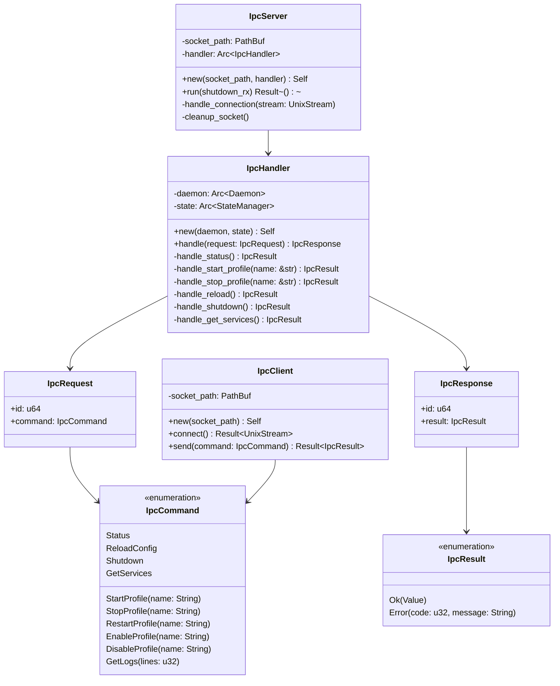
```mermaid
classDiagram
    class IpcServer {
        -socket_path: PathBuf
        -handler: Arc~IpcHandler~
        +new(socket_path, handler) Self
        +run(shutdown_rx) Result~()~
        -handle_connection(stream: UnixStream)
        -cleanup_socket()
    }

    class IpcHandler {
        -daemon: Arc~Daemon~
        -state: Arc~StateManager~
        +new(daemon, state) Self
        +handle(request: IpcRequest) IpcResponse
        -handle_status() IpcResult
        -handle_start_profile(name: &str) IpcResult
        -handle_stop_profile(name: &str) IpcResult
        -handle_reload() IpcResult
        -handle_shutdown() IpcResult
        -handle_get_services() IpcResult
    }

    class IpcRequest {
        +id: u64
        +command: IpcCommand
    }

    class IpcCommand {
        <<enumeration>>
        Status
        StartProfile(name: String)
        StopProfile(name: String)
        RestartProfile(name: String)
        EnableProfile(name: String)
        DisableProfile(name: String)
        ReloadConfig
        Shutdown
        GetServices
        GetLogs(lines: u32)
    }

    class IpcResponse {
        +id: u64
        +result: IpcResult
    }

    class IpcResult {
        <<enumeration>>
        Ok(Value)
        Error(code: u32, message: String)
    }

    class IpcClient {
        -socket_path: PathBuf
        +new(socket_path) Self
        +connect() Result~UnixStream~
        +send(command: IpcCommand) Result~IpcResult~
    }

    IpcServer --> IpcHandler
    IpcHandler --> IpcRequest
    IpcHandler --> IpcResponse
    IpcRequest --> IpcCommand
    IpcResponse --> IpcResult
    IpcClient --> IpcCommand
```

## 7. Sequence Diagram - Daemon Startup

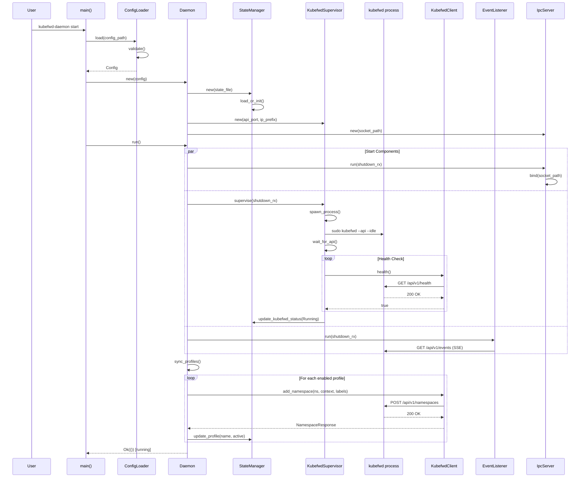
```mermaid
sequenceDiagram
    participant User
    participant Main as main()
    participant Config as ConfigLoader
    participant Daemon
    participant State as StateManager
    participant Supervisor as KubefwdSupervisor
    participant Kubefwd as kubefwd process
    participant Client as KubefwdClient
    participant Events as EventListener
    participant IPC as IpcServer

    User->>Main: kubefwd-daemon start
    Main->>Config: load(config_path)
    Config->>Config: validate()
    Config-->>Main: Config

    Main->>Daemon: new(config)
    Daemon->>State: new(state_file)
    State->>State: load_or_init()

    Daemon->>Supervisor: new(api_port, ip_prefix)
    Daemon->>IPC: new(socket_path)

    Main->>Daemon: run()

    par Start Components
        Daemon->>IPC: run(shutdown_rx)
        IPC->>IPC: bind(socket_path)
    and
        Daemon->>Supervisor: supervise(shutdown_rx)
        Supervisor->>Supervisor: spawn_process()
        Supervisor->>Kubefwd: sudo kubefwd --api --idle
        Supervisor->>Supervisor: wait_for_api()

        loop Health Check
            Supervisor->>Client: health()
            Client->>Kubefwd: GET /api/v1/health
            Kubefwd-->>Client: 200 OK
            Client-->>Supervisor: true
        end

        Supervisor->>State: update_kubefwd_status(Running)
    and
        Daemon->>Events: run(shutdown_rx)
        Events->>Kubefwd: GET /api/v1/events (SSE)
    end

    Daemon->>Daemon: sync_profiles()

    loop For each enabled profile
        Daemon->>Client: add_namespace(ns, context, labels)
        Client->>Kubefwd: POST /api/v1/namespaces
        Kubefwd-->>Client: 200 OK
        Client-->>Daemon: NamespaceResponse
        Daemon->>State: update_profile(name, active)
    end

    Daemon-->>Main: Ok(()) [running]
```

## 8. Sequence Diagram - SSE Event Handling

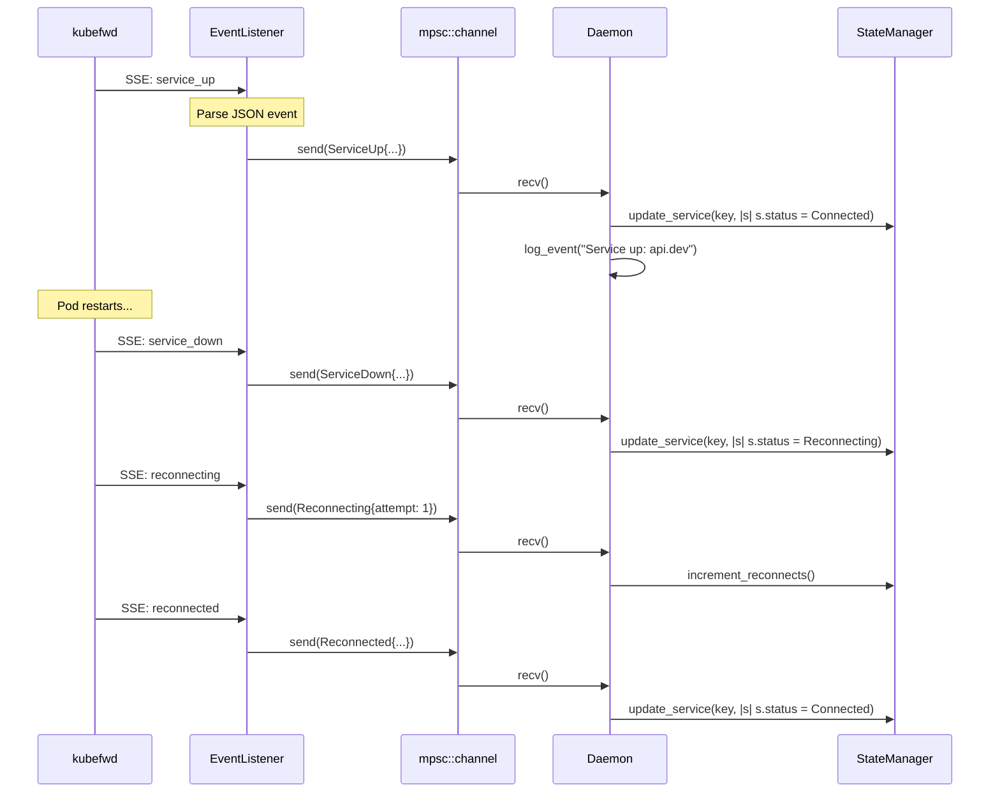
```mermaid
sequenceDiagram
    participant Kubefwd as kubefwd
    participant Events as EventListener
    participant Channel as mpsc::channel
    participant Daemon
    participant State as StateManager

    Kubefwd->>Events: SSE: service_up
    Note over Events: Parse JSON event
    Events->>Channel: send(ServiceUp{...})
    Channel->>Daemon: recv()
    Daemon->>State: update_service(key, |s| s.status = Connected)
    Daemon->>Daemon: log_event("Service up: api.dev")

    Note over Kubefwd: Pod restarts...

    Kubefwd->>Events: SSE: service_down
    Events->>Channel: send(ServiceDown{...})
    Channel->>Daemon: recv()
    Daemon->>State: update_service(key, |s| s.status = Reconnecting)

    Kubefwd->>Events: SSE: reconnecting
    Events->>Channel: send(Reconnecting{attempt: 1})
    Channel->>Daemon: recv()
    Daemon->>State: increment_reconnects()

    Kubefwd->>Events: SSE: reconnected
    Events->>Channel: send(Reconnected{...})
    Channel->>Daemon: recv()
    Daemon->>State: update_service(key, |s| s.status = Connected)
```

## 9. Sequence Diagram - CLI Status Command

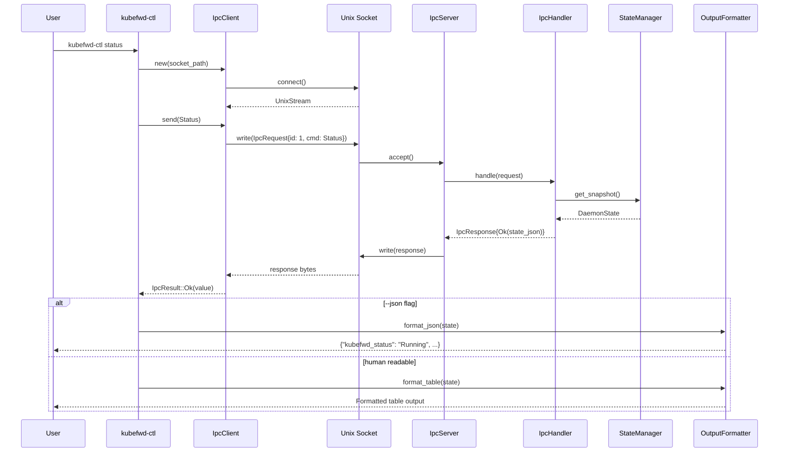
```mermaid
sequenceDiagram
    participant User
    participant CLI as kubefwd-ctl
    participant IpcClient
    participant Socket as Unix Socket
    participant IpcServer
    participant Handler as IpcHandler
    participant State as StateManager
    participant Output as OutputFormatter

    User->>CLI: kubefwd-ctl status
    CLI->>IpcClient: new(socket_path)
    IpcClient->>Socket: connect()
    Socket-->>IpcClient: UnixStream

    CLI->>IpcClient: send(Status)
    IpcClient->>Socket: write(IpcRequest{id: 1, cmd: Status})

    Socket->>IpcServer: accept()
    IpcServer->>Handler: handle(request)
    Handler->>State: get_snapshot()
    State-->>Handler: DaemonState

    Handler-->>IpcServer: IpcResponse{Ok(state_json)}
    IpcServer->>Socket: write(response)
    Socket-->>IpcClient: response bytes

    IpcClient-->>CLI: IpcResult::Ok(value)

    alt --json flag
        CLI->>Output: format_json(state)
        Output-->>User: {"kubefwd_status": "Running", ...}
    else human readable
        CLI->>Output: format_table(state)
        Output-->>User: Formatted table output
    end
```

## 10. Sequence Diagram - Kubefwd Crash Recovery

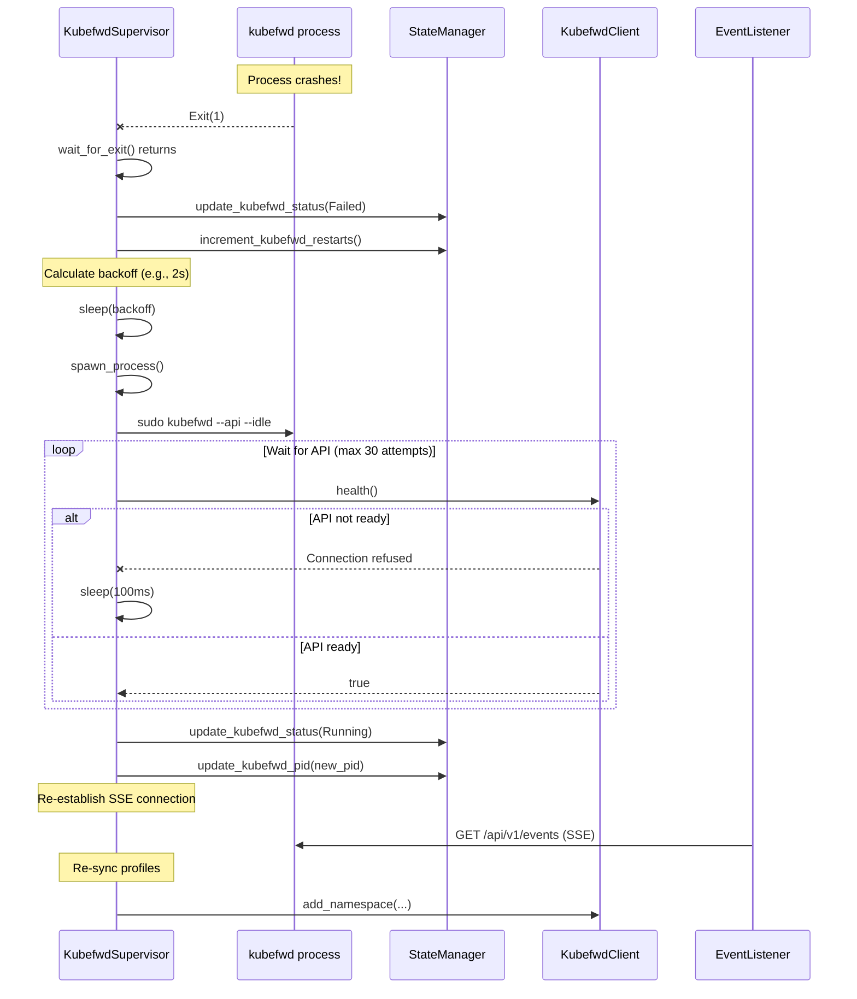
```mermaid
sequenceDiagram
    participant Supervisor as KubefwdSupervisor
    participant Kubefwd as kubefwd process
    participant State as StateManager
    participant Client as KubefwdClient
    participant Events as EventListener

    Note over Kubefwd: Process crashes!
    Kubefwd--xSupervisor: Exit(1)

    Supervisor->>Supervisor: wait_for_exit() returns
    Supervisor->>State: update_kubefwd_status(Failed)
    Supervisor->>State: increment_kubefwd_restarts()

    Note over Supervisor: Calculate backoff (e.g., 2s)
    Supervisor->>Supervisor: sleep(backoff)

    Supervisor->>Supervisor: spawn_process()
    Supervisor->>Kubefwd: sudo kubefwd --api --idle

    loop Wait for API (max 30 attempts)
        Supervisor->>Client: health()
        alt API not ready
            Client--xSupervisor: Connection refused
            Supervisor->>Supervisor: sleep(100ms)
        else API ready
            Client-->>Supervisor: true
        end
    end

    Supervisor->>State: update_kubefwd_status(Running)
    Supervisor->>State: update_kubefwd_pid(new_pid)

    Note over Supervisor: Re-establish SSE connection
    Events->>Kubefwd: GET /api/v1/events (SSE)

    Note over Supervisor: Re-sync profiles
    Supervisor->>Client: add_namespace(...)
```

## 11. State Machine - Kubefwd Status

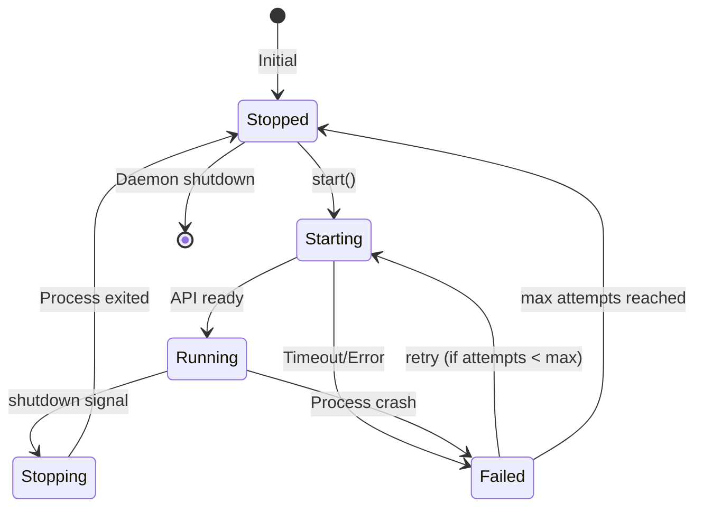
```mermaid
stateDiagram-v2
    [*] --> Stopped: Initial

    Stopped --> Starting: start()
    Starting --> Running: API ready
    Starting --> Failed: Timeout/Error

    Running --> Stopping: shutdown signal
    Running --> Failed: Process crash

    Failed --> Starting: retry (if attempts < max)
    Failed --> Stopped: max attempts reached

    Stopping --> Stopped: Process exited

    Stopped --> [*]: Daemon shutdown
```

## 12. State Machine - Service Status

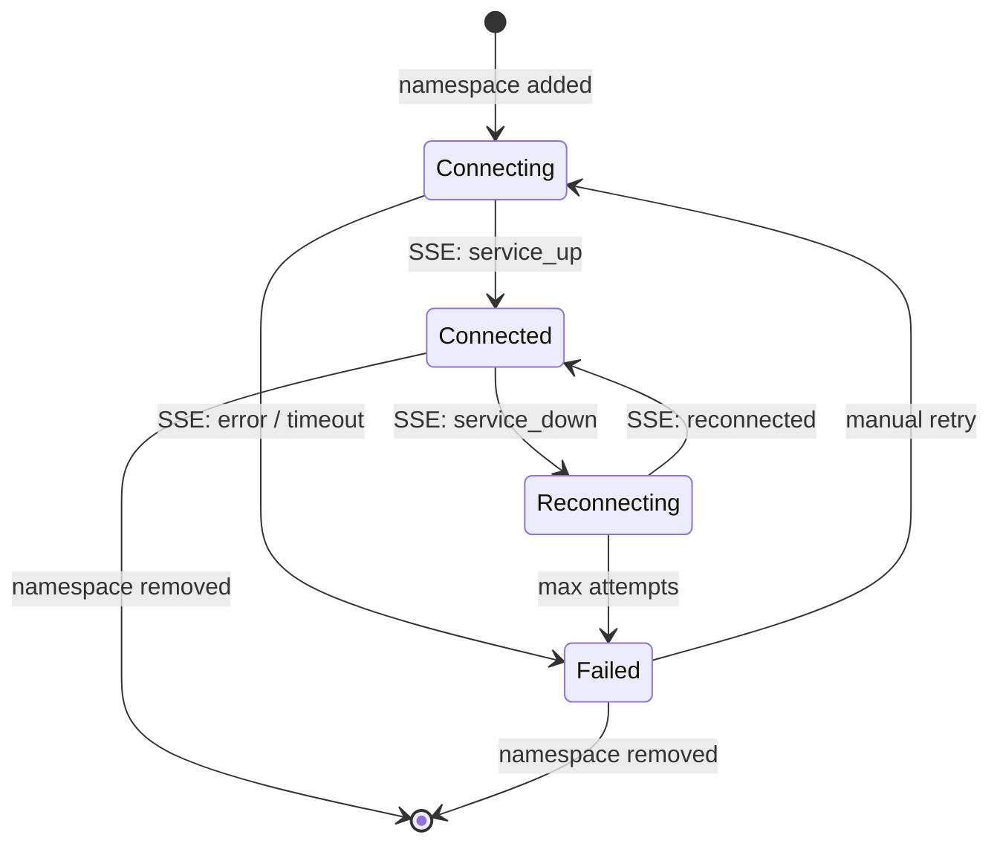
```mermaid
stateDiagram-v2
    [*] --> Connecting: namespace added

    Connecting --> Connected: SSE: service_up
    Connecting --> Failed: SSE: error / timeout

    Connected --> Reconnecting: SSE: service_down
    Connected --> [*]: namespace removed

    Reconnecting --> Connected: SSE: reconnected
    Reconnecting --> Failed: max attempts

    Failed --> Connecting: manual retry
    Failed --> [*]: namespace removed
```

## 13. Activity Diagram - Profile Sync

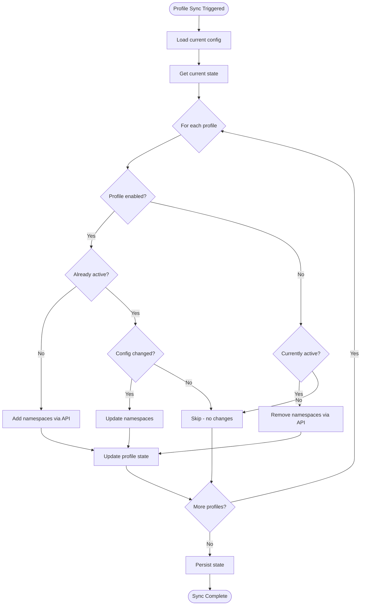
```mermaid
flowchart TD
    Start([Profile Sync Triggered]) --> LoadConfig[Load current config]
    LoadConfig --> GetState[Get current state]
    GetState --> CompareLoop{For each profile}

    CompareLoop --> CheckEnabled{Profile enabled?}

    CheckEnabled -->|Yes| CheckActive{Already active?}
    CheckEnabled -->|No| CheckNeedsRemove{Currently active?}

    CheckActive -->|No| AddNamespaces[Add namespaces via API]
    CheckActive -->|Yes| CheckChanged{Config changed?}

    CheckChanged -->|Yes| UpdateNamespaces[Update namespaces]
    CheckChanged -->|No| Skip[Skip - no changes]

    CheckNeedsRemove -->|Yes| RemoveNamespaces[Remove namespaces via API]
    CheckNeedsRemove -->|No| Skip

    AddNamespaces --> UpdateState[Update profile state]
    UpdateNamespaces --> UpdateState
    RemoveNamespaces --> UpdateState
    Skip --> NextProfile

    UpdateState --> NextProfile{More profiles?}
    NextProfile -->|Yes| CompareLoop
    NextProfile -->|No| PersistState[Persist state]
    PersistState --> End([Sync Complete])
```

## 14. Component Diagram - Nix Integration

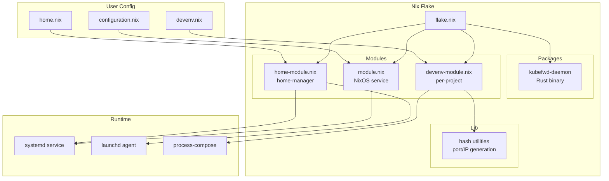
```mermaid
graph TB
    subgraph "Nix Flake"
        Flake[flake.nix]

        subgraph "Packages"
            Pkg[kubefwd-daemon<br/>Rust binary]
        end

        subgraph "Modules"
            NixOS[module.nix<br/>NixOS service]
            Home[home-module.nix<br/>home-manager]
            Devenv[devenv-module.nix<br/>per-project]
        end

        subgraph "Lib"
            HashLib[hash utilities<br/>port/IP generation]
        end
    end

    subgraph "User Config"
        NixOSConfig[configuration.nix]
        HomeConfig[home.nix]
        DevenvConfig[devenv.nix]
    end

    subgraph "Runtime"
        SystemD[systemd service]
        LaunchD[launchd agent]
        ProcessCompose[process-compose]
    end

    Flake --> Pkg
    Flake --> NixOS
    Flake --> Home
    Flake --> Devenv

    NixOSConfig --> NixOS
    HomeConfig --> Home
    DevenvConfig --> Devenv

    NixOS --> SystemD
    Home --> SystemD
    Home --> LaunchD
    Devenv --> ProcessCompose

    Devenv --> HashLib
```

## 15. Deployment Diagram

```mermaid
graph TB
    subgraph "Developer Machine"
        subgraph "Project A Directory"
            DevenvA[devenv shell]
            DaemonA[kubefwd-daemon<br/>port: 10234<br/>IP: 127.42.x.x]
            KubefwdA[kubefwd<br/>API: :10234]
        end

        subgraph "Project B Directory"
            DevenvB[devenv shell]
            DaemonB[kubefwd-daemon<br/>port: 10567<br/>IP: 127.89.x.x]
            KubefwdB[kubefwd<br/>API: :10567]
        end

        EtcHosts[/etc/hosts]
        Kubeconfig[~/.kube/config]
    end

    subgraph "Kubernetes Cluster"
        APIServer[API Server]
        PodA1[Pod: api-gateway]
        PodA2[Pod: postgres]
        PodB1[Pod: analytics-api]
    end

    DevenvA --> DaemonA
    DaemonA --> KubefwdA
    KubefwdA --> EtcHosts
    KubefwdA --> Kubeconfig
    KubefwdA --> APIServer

    DevenvB --> DaemonB
    DaemonB --> KubefwdB
    KubefwdB --> EtcHosts
    KubefwdB --> Kubeconfig
    KubefwdB --> APIServer

    APIServer --> PodA1
    APIServer --> PodA2
    APIServer --> PodB1
```

## 16. Error Handling Class Diagram

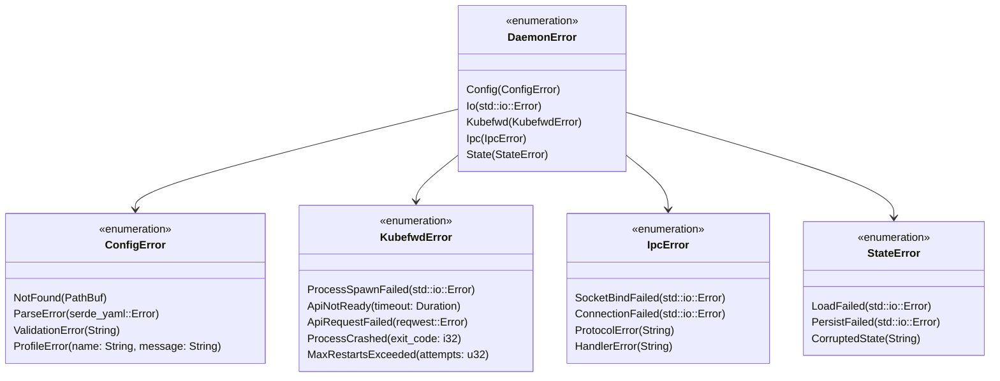
```mermaid
classDiagram
    class DaemonError {
        <<enumeration>>
        Config(ConfigError)
        Io(std::io::Error)
        Kubefwd(KubefwdError)
        Ipc(IpcError)
        State(StateError)
    }

    class ConfigError {
        <<enumeration>>
        NotFound(PathBuf)
        ParseError(serde_yaml::Error)
        ValidationError(String)
        ProfileError(name: String, message: String)
    }

    class KubefwdError {
        <<enumeration>>
        ProcessSpawnFailed(std::io::Error)
        ApiNotReady(timeout: Duration)
        ApiRequestFailed(reqwest::Error)
        ProcessCrashed(exit_code: i32)
        MaxRestartsExceeded(attempts: u32)
    }

    class IpcError {
        <<enumeration>>
        SocketBindFailed(std::io::Error)
        ConnectionFailed(std::io::Error)
        ProtocolError(String)
        HandlerError(String)
    }

    class StateError {
        <<enumeration>>
        LoadFailed(std::io::Error)
        PersistFailed(std::io::Error)
        CorruptedState(String)
    }

    DaemonError --> ConfigError
    DaemonError --> KubefwdError
    DaemonError --> IpcError
    DaemonError --> StateError
```

## 17. Data Flow Diagram

```mermaid
flowchart LR
    subgraph "Input"
        ConfigFile[(config.yaml)]
        UserCLI[CLI Commands]
        K8sEvents[K8s Pod Events]
    end

    subgraph "Processing"
        ConfigLoader[Config Loader]
        IpcHandler[IPC Handler]
        EventProcessor[Event Processor]
        Supervisor[Supervisor]
    end

    subgraph "State"
        StateManager[(State Manager)]
    end

    subgraph "Output"
        Kubefwd[kubefwd REST API]
        Logs[Log Files]
        CLIOutput[CLI Output]
        HostsFile[/etc/hosts]
    end

    ConfigFile --> ConfigLoader
    ConfigLoader --> StateManager

    UserCLI --> IpcHandler
    IpcHandler --> StateManager
    IpcHandler --> Supervisor
    IpcHandler --> CLIOutput

    K8sEvents --> Kubefwd
    Kubefwd --> EventProcessor
    EventProcessor --> StateManager
    EventProcessor --> Logs

    Supervisor --> Kubefwd
    Kubefwd --> HostsFile

    StateManager --> Logs
```

## 18. Package Dependencies

```mermaid
graph TD
    subgraph "Core"
        tokio[tokio<br/>async runtime]
        anyhow[anyhow<br/>error handling]
        thiserror[thiserror<br/>error derive]
        tracing[tracing<br/>logging]
    end

    subgraph "Serialization"
        serde[serde<br/>serialize/deserialize]
        serde_json[serde_json<br/>JSON]
        serde_yaml[serde_yaml<br/>YAML config]
    end

    subgraph "HTTP/Network"
        reqwest[reqwest<br/>HTTP client]
        reqwest_eventsource[reqwest-eventsource<br/>SSE client]
    end

    subgraph "CLI"
        clap[clap<br/>argument parsing]
        comfy_table[comfy-table<br/>table output]
        colored[colored<br/>terminal colors]
    end

    subgraph "System"
        nix_crate[nix<br/>Unix APIs]
        libc[libc<br/>C bindings]
        dirs[dirs<br/>XDG paths]
    end

    subgraph "Time"
        chrono[chrono<br/>datetime]
        humantime[humantime-serde<br/>duration parsing]
    end

    kubefwd_daemon[kubefwd-daemon] --> tokio
    kubefwd_daemon --> anyhow
    kubefwd_daemon --> thiserror
    kubefwd_daemon --> tracing
    kubefwd_daemon --> serde
    kubefwd_daemon --> serde_json
    kubefwd_daemon --> serde_yaml
    kubefwd_daemon --> reqwest
    kubefwd_daemon --> reqwest_eventsource
    kubefwd_daemon --> clap
    kubefwd_daemon --> comfy_table
    kubefwd_daemon --> colored
    kubefwd_daemon --> nix_crate
    kubefwd_daemon --> libc
    kubefwd_daemon --> dirs
    kubefwd_daemon --> chrono
    kubefwd_daemon --> humantime
```

## 19. Test Architecture

```mermaid
graph TB
    subgraph "Unit Tests"
        ConfigTests[config::tests<br/>Parsing, validation]
        StateTests[state::tests<br/>State transitions]
        ProtocolTests[ipc::protocol::tests<br/>Message encoding]
        BackoffTests[kubefwd::tests<br/>Backoff calculation]
    end

    subgraph "Integration Tests"
        DaemonTests[tests/daemon.rs<br/>Full lifecycle]
        IpcTests[tests/ipc.rs<br/>CLI ↔ Daemon]
        KubefwdTests[tests/kubefwd.rs<br/>Mock API interaction]
    end

    subgraph "Test Infrastructure"
        MockKubefwd[MockKubefwd<br/>Fake REST API + SSE]
        TestConfig[test_config()<br/>Test fixtures]
        TempDir[tempdir<br/>Isolated state]
    end

    subgraph "Nix Tests"
        NixosTest[nix/tests/integration.nix<br/>VM-based test]
    end

    DaemonTests --> MockKubefwd
    IpcTests --> MockKubefwd
    KubefwdTests --> MockKubefwd

    DaemonTests --> TestConfig
    DaemonTests --> TempDir
```

## 20. Sequence Diagram - Devenv Lifecycle

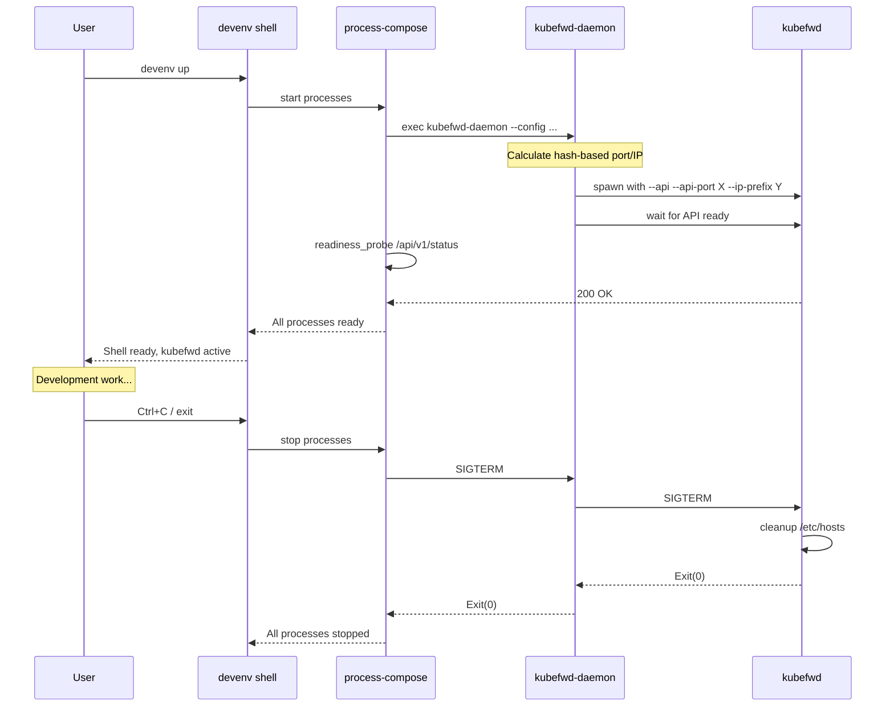
```mermaid
sequenceDiagram
    participant User
    participant Shell as devenv shell
    participant PC as process-compose
    participant Daemon as kubefwd-daemon
    participant Kubefwd as kubefwd

    User->>Shell: devenv up
    Shell->>PC: start processes

    PC->>Daemon: exec kubefwd-daemon --config ...
    Note over Daemon: Calculate hash-based port/IP

    Daemon->>Kubefwd: spawn with --api --api-port X --ip-prefix Y
    Daemon->>Kubefwd: wait for API ready

    PC->>PC: readiness_probe /api/v1/status
    Kubefwd-->>PC: 200 OK

    PC-->>Shell: All processes ready
    Shell-->>User: Shell ready, kubefwd active

    Note over User: Development work...

    User->>Shell: Ctrl+C / exit
    Shell->>PC: stop processes

    PC->>Daemon: SIGTERM
    Daemon->>Kubefwd: SIGTERM
    Kubefwd->>Kubefwd: cleanup /etc/hosts
    Kubefwd-->>Daemon: Exit(0)
    Daemon-->>PC: Exit(0)

    PC-->>Shell: All processes stopped
```
